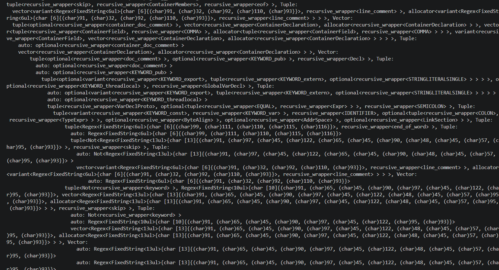

# Grammar Metaprogram Generator
This example shows a metaprogram that can parse PEG files and a code generator that can transpile the parsed PEG syntax into an equivalent metaprogram. 

It was them demonstrated on the zig language, which has a publicly available PEG specification. The result is a hello world zig program that is parsed with the generated metaprogram.

- `codegen/peg_metaprogram.h` defines PEG syntax in the C++ metaprogram. This effectively creates a parser that can parse PEG syntax.  
- `codegen/peg_codegen.[h/cpp]` reads the syntax tree produced by the metaprogram and generates a metaprogram for that grammar.
- `generate_zig_metaprogram.cpp` reads the official zig spec from `data/zig.peg` and generates the metaprogram `generated/zig_metaprogram.h`. 
- `zig_parser.cpp` imports the generated metaprogram and parses a zig file (i.e. `data/hello_world.zig`). It then uses the `GenericNodePrinter` to print the resulting matched syntax tree.

The metaprogram and resulting syntax tree are overly verbose since it is a generated program. Forward declarations and wrappers were used everywhere to avoid recursion automatically, even on types that aren't recursive. 

This example isn't meant to be useful, it is just to demonstrate the library's functionality.

## Usage
1. `bazel run //examples/peg_gen:generate_zig_metaprogram`

This parses `data/zig.peg` and generates `generated/zig_metaprogram.h`.

2. `bazel run //examples/peg_gen:zig_parser -- /path/to/hello_world.zig`

This reads the zig file and outputs the parsed syntax tree. The parsed syntax tree will likely not be human readable since it is extremely verbose with C++ types. Further work would be needed simplify the syntax and beutifuy the tree printing.

Snippet of syntax tree output:
